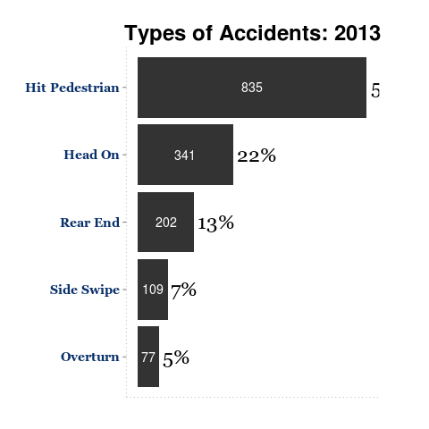

---
output:
  html_document:
    css: ari_style.css
  word_document: default
---

Bangladesh government banned all types three wheelers in 22 national highway in Bangldesh effective from last August 1, 2015. But the problem is right now it is little bit difficult to connect three wheelers with high rate of road accidents in Bangldesh. 

The death in road accidents vary wildly in Bangldesh. Official figures puts the number around 3,000 but other sources put the number from 12,000 to 20,000. In a report of World Health Organisation (WHO), [according to Prothom-alo](http://goo.gl/RlzFTp), in 2012 in Bangladesh 21,316 but in that report we did not find any sources of those information on how WHO collected that data. You can find the full report [here](http://www.who.int/violence_injury_prevention/road_safety_status/2015/en/).

The objective of this blog is not understanding the issue of huge discrepancy of reporting road accident death numbers but rather discussing the issue of banning three wheelers in Bangladesh highways. 

In common perception, the idea is that most of the death happens on the national highways where heavy vehicles are involved in head on collisions with other. Actually this is one of the reasons which probably prompted the ban. When a fast moving heavy vehicle finds a slow moving three wheeler in front of it, the first thing it tries is to over take it. This often results in collission from vehicles coming from opposite direction. 

If this proposition is correct then we would assume that head on collision will act the major source of casualty in road accidents. But let's see what we get from official statistics. Following analysis is done from the official statistics collected from Accident Research Institute (ARI) database. 

In the following we see a graph of the different types of Accidents distribution in 2013

 

